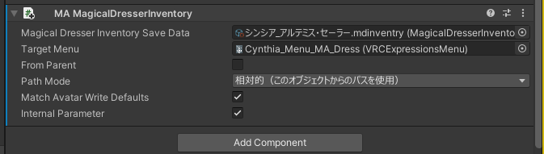

# MagicalDresserInventorySystemModularAvatarExtension

Modular AvatarとMagicalDresserInventorySystem（マジックドレッサーインベントリ）の連携

## インストール

1. https://vpm.narazaka.net/ から「Add to VCC」ボタンを押してリポジトリをVCCにインストールします。
2. VCCでSettings→Packages→Installed Repositoriesの一覧中で「Narazaka VPM Listing」にチェックが付いていることを確認します。
3. アバタープロジェクトの「Manage Project」から「MagicalDresserInventorySystem ModularAvatar Extension」をインストールします。

## 使い方

「Add Component」から「MA MagicalDresserInventory」を追加してよしなに

「MA MagicalDresserInventory」はマジックドレッサーインベントリのアセットを指定するだけで、そのAnimator、メニュー、パラメーターをMAで結合するコンポーネントです。
マジックドレッサーインベントリの各Animatorやメニューは再セットアップするごとに参照が変わってしまい、かつパラメーターもMA移植するのが面倒であるために、そのままではMAで結合するのが煩わしいため作りました。

マジックドレッサーインベントリ自体の挙動は変更しないため、マジックドレッサーインベントリのセットアップ時にアバターデータを破壊的変更しないためには、事前に空のメニューやAnimatorを設定しておくなどの対策が必要になります。VRCAssetMergerについてくるVRCAvatarAssetsSetterなどを使って下さい。

## License

[Zlib License](LICENSE.txt)
